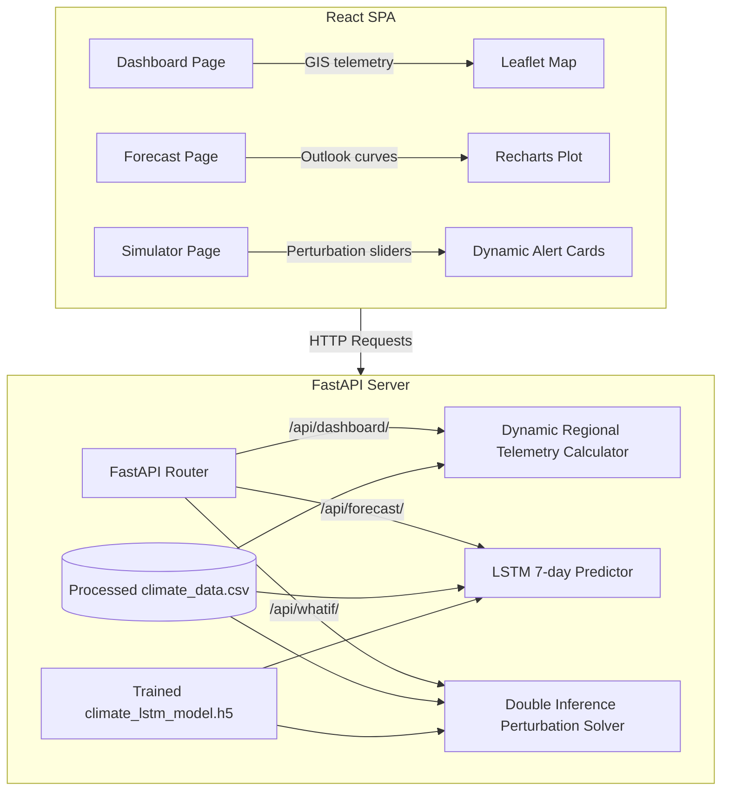

# AI-Powered Digital Twin of India's Climate

This repository implements a Proof of Concept (PoC) **AI-Powered Digital Twin of India's Climate**. The system provides an interactive digital model of subcontinental climate systems by combining historical records with deep learning weather forecasts.

---

## 🌐 Live Demo

You can explore the live deployments of this digital twin system at the following addresses:
- **Frontend Dashboard**: [https://ai-powered-digital-twin.vercel.app](https://ai-powered-digital-twin.vercel.app)
- **Backend API & Swagger Docs**: [https://ai-powereddigitaltwin.onrender.com/docs](https://ai-powereddigitaltwin.onrender.com/docs) (or health endpoint at [https://ai-powereddigitaltwin.onrender.com/health](https://ai-powereddigitaltwin.onrender.com/health))

---

## 📌 Problem Statement

Predicting weather patterns and simulating future climate impacts on a regional scale is highly challenging. India’s diverse climate zones are highly vulnerable to extreme events such as heatwaves, heavy rainfall, and droughts, which pose severe risks to agriculture, water reserves, and grid infrastructure. Traditional numerical weather models are computationally intensive and slow to respond to real-time queries. 

This **Climate Digital Twin** PoC addresses these challenges by:
- **Serving as a Real-Time Control Room**: Unifying spatial-temporal telemetry data onto an interactive GIS canvas.
- **Providing Multi-Step ML Forecasts**: Delivering rapid, 7-day-ahead projections using lightweight deep learning.
- **Running What-If Perturbations**: Allowing researchers to simulate climatic disruptions (e.g., precipitation variance, temperature shifts) in a sandbox environment to inspect cascade impacts on critical resources.

---

## 📊 Data Sources

The platform uses high-resolution daily gridded climate datasets from the **India Meteorological Department (IMD)** spanning **2015 to 2025**.
- **Variables**: daily gridded rainfall (mm), daily maximum temperature (°C), and daily minimum temperature (°C).
- **Processing**: The raw grid-level files are preprocessed to calculate a single national daily average across all of India.
- **Scale**: The dataset contains 11 years of continuous daily records, capturing seasonal monsoonal trends, heat waves, and annual variations.
- **File location**: The processed historical data is stored in [climate_data.csv](file:///c:/Users/karti/OneDrive/Desktop/AI-PoweredDigitalTwin/data/processed/climate_data.csv).

---

## 🌟 Key Features

### 📡 1. Climate Control Room (Dashboard)
- **Interactive Leaflet GIS Mapping**: Displays key subcontinental climate monitoring nodes (Mumbai, Delhi, Chennai, Kolkata, Guwahati, Bengaluru) for visual context, while the telemetry panel plots the national daily averages.
- **Dynamic Telemetry Stream**: Reads processed historical IMD records to dynamically compute rainfall accumulation, average maximum temperature, and drought risk indexes (D-Index) instead of relying on mock baselines.
- **Anomaly Warnings**: Dynamic classification rules generate status warnings (e.g., *Heatwave Warning*, *Excessive Rainfall*) and corresponding alert colors based on physical telemetry thresholds.

### 🔮 2. Climate Forecast Engine
- **LSTM Forecasting**: Runs a trained **Long Short-Term Memory (LSTM)** recurrent neural network model to predict 7-day ahead rainfall, max temperature, and min temperature.
- **Sequence Context**: Uses the last 7 days of historical weather metrics (rainfall, tempmax, tempmin, day of year, month) scaled through MinMaxScalers to generate forecast cycles.
- **Data Integrity**: Enforces physical boundaries (e.g., non-negative rainfall volumes, min temp <= max temp) and outputs clean visual trend graphs via Recharts.

### 🧪 3. What-If Simulator
- **Environmental Perturbations**: Adjust sliders to inject custom changes into the climate context window (Precipitation Variance: -50% to +50%, Thermal Gradient Shift: -2.0°C to +5.0°C).
- **30-Day Context Shifts**: Applies the variance across the entire 30-day window, slicing the final week to run dual inference (baseline vs. perturbed sequence) through the LSTM neural net.
- **Direct Model Impacts**: Calculates exact, unweighted percentage deviations of rainfall, temperature, and drought risks computed from model output tensors. These shifts map directly to the *Agricultural Yield*, *Water Supply Capacity*, and *Grid Stability* indicators.

---

## ⚙️ Architecture & Tech Stack



The digital twin architecture utilizes the following technologies:
- **Backend API**: Python 3.10+, FastAPI (served via Uvicorn ASGI server)
- **Deep Learning & Modeling**: TensorFlow / Keras (LSTM RNN model stored at [climate_lstm_model.h5](file:///c:/Users/karti/OneDrive/Desktop/AI-PoweredDigitalTwin/models/saved_models/climate_lstm_model.h5)), Scikit-Learn (feature scaling), Pandas, NumPy
- **Frontend SPA**: React (Vite), React-Leaflet (GIS Mapping & visualization), Recharts (data visualizations), TailwindCSS (styling), Lucide-React (icons)

---

## 📈 Model Architecture & Evaluation Results

The deep learning forecasting model uses a recurrent neural network architecture trained to map the previous week's climate context into a 7-day multi-variable climate projection.

### Model Details
- **Architecture**: `LSTM(64)` -> `Dense(32)` -> `Dense(21)` -> `Reshape(7, 3)`
- **Input shape**: Sequence of 7 steps with 5 features (scaled target metrics: rainfall, tempmax, tempmin + time features: day of year, month)
- **Output shape**: Sequence of 7 steps with 3 features (rainfall, tempmax, tempmin)
- **Training Split**: January 1, 2015 – December 31, 2023 (3,287 days of training context)
- **Test Split (Evaluation)**: January 1, 2024 – December 31, 2025 (731 days of testing context)

### Evaluation Metrics
Following training (15 epochs, Adam optimizer, MSE loss), the model was evaluated on the unseen test set (2024-2025). The resulting **Root Mean Squared Error (RMSE)** values are:

| Climate Variable | Test Set RMSE | Unit |
| :--- | :--- | :--- |
| **Rainfall** | 1.7821 | mm |
| **Daily Maximum Temperature (Temp Max)** | 1.0076 | °C |
| **Daily Minimum Temperature (Temp Min)** | 1.0487 | °C |

*Predictions vs. actual values for 1-day ahead forecasts are logged in [prediction_evaluation_plot.png](file:///c:/Users/karti/OneDrive/Desktop/AI-PoweredDigitalTwin/notebooks/model_experiments/prediction_evaluation_plot.png).*

---

## 📂 Project Structure

```
├── data/
│   └── processed/
│       └── [climate_data.csv](file:///c:/Users/karti/OneDrive/Desktop/AI-PoweredDigitalTwin/data/processed/climate_data.csv)        # Preprocessed daily spatial averages (2015-2025)
├── models/
│   └── saved_models/
│       └── [climate_lstm_model.h5](file:///c:/Users/karti/OneDrive/Desktop/AI-PoweredDigitalTwin/models/saved_models/climate_lstm_model.h5)   # Pre-trained Keras LSTM model
├── backend/
│   ├── app/
│   │   ├── api/
│   │   │   ├── [dashboard.py](file:///c:/Users/karti/OneDrive/Desktop/AI-PoweredDigitalTwin/backend/app/api/dashboard.py)        # Dashboard endpoint (dynamically maps CSV stats)
│   │   │   ├── [forecast.py](file:///c:/Users/karti/OneDrive/Desktop/AI-PoweredDigitalTwin/backend/app/api/forecast.py)         # Forecast endpoint (loads LSTM, outputs predictions)
│   │   │   └── [whatif.py](file:///c:/Users/karti/OneDrive/Desktop/AI-PoweredDigitalTwin/backend/app/api/whatif.py)           # Simulation endpoint (perturbed model inference)
│   │   ├── [main.py](file:///c:/Users/karti/OneDrive/Desktop/AI-PoweredDigitalTwin/backend/app/main.py)                 # FastAPI application main entrypoint
│   │   └── requirements.txt        # Backend dependencies list
│   └── [requirements.txt](file:///c:/Users/karti/OneDrive/Desktop/AI-PoweredDigitalTwin/backend/requirements.txt)            # Root folder backend dependencies list
├── frontend/
│   ├── src/
│   │   ├── pages/
│   │   │   ├── [Dashboard.jsx](file:///c:/Users/karti/OneDrive/Desktop/AI-PoweredDigitalTwin/frontend/src/pages/Dashboard.jsx)       # GIS control room view
│   │   │   ├── [Forecast.jsx](file:///c:/Users/karti/OneDrive/Desktop/AI-PoweredDigitalTwin/frontend/src/pages/Forecast.jsx)        # 7-day ML projections view
│   │   │   └── [WhatIfSimulator.jsx](file:///c:/Users/karti/OneDrive/Desktop/AI-PoweredDigitalTwin/frontend/src/pages/WhatIfSimulator.jsx) # Environmental sandbox view
│   │   └── App.jsx                 # Client routes
│   └── [package.json](file:///c:/Users/karti/OneDrive/Desktop/AI-PoweredDigitalTwin/frontend/package.json)                # Frontend package scripts and dependencies
```

---

## 🚀 Setup & Run Instructions

Follow these steps to launch the backend API and frontend client locally on your machine.

### 1. Prerequisites
Ensure you have the following installed:
- [Python 3.10+](https://www.python.org/downloads/)
- [Node.js 18+](https://nodejs.org/)

---

### 2. Backend Server Setup

Navigate to the `backend` directory, set up a virtual environment, and launch the server:

1. **Open a terminal** and navigate to the backend folder:
   ```bash
   cd backend
   ```

2. **Create a virtual environment**:
   ```bash
   python -m venv venv
   ```

3. **Activate the virtual environment**:
   - **Windows PowerShell**:
     ```powershell
     .\venv\Scripts\Activate.ps1
     ```
   - **Windows Command Prompt**:
     ```cmd
     .\venv\Scripts\activate.bat
     ```
   - **Linux / macOS Terminal**:
     ```bash
     source venv/bin/activate
     ```

4. **Install backend dependencies**:
   ```bash
   pip install -r requirements.txt
   ```

5. **Start the FastAPI server using Uvicorn**:
   ```bash
   uvicorn app.main:app --reload --port 8000
   ```
   *The server will start reloading and will bind to `http://localhost:8000`.*

---

### 3. Frontend Client Setup

Open a new terminal window to build and run the React frontend dashboard:

1. **Navigate to the frontend folder**:
   ```bash
   cd frontend
   ```

2. **Install node packages**:
   ```bash
   npm install
   ```

3. **Run the Vite development server**:
   ```bash
   npm run dev
   ```
   *The client will boot up and run at `http://localhost:5173` or `http://localhost:5174`.*

Open your web browser and navigate to the local frontend address (e.g. `http://localhost:5173`) to explore the climate digital twin dashboard!
